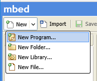
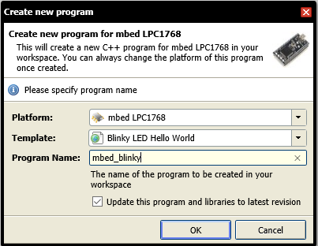
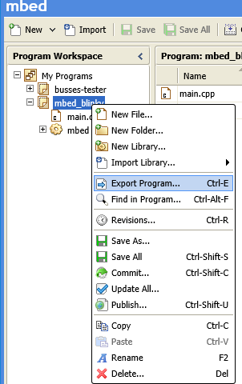
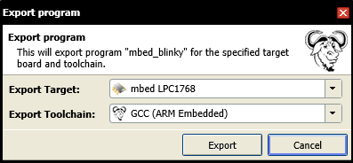
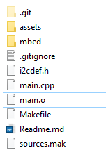

Busses-tester: Test device for I2C/SPI master interfaces
=========================================

This repository contains mbed LPC1768 firmware that enables functional testing of I2C and SPI mater interfaces. This device is used by the Windows.Devices.I2c and Windows.Devices.Spi Hardware Lab Kit (HLK) tests. The HLK comes with a prebuilt binary of this firmware image.  

This project has adopted the [Microsoft Open Source Code of Conduct](https://opensource.microsoft.com/codeofconduct/). For more information see the [Code of Conduct FAQ](https://opensource.microsoft.com/codeofconduct/faq/) or contact [opencode@microsoft.com](mailto:opencode@microsoft.com) with any additional questions or comments.

# Building the code

 1. Clone this repository
 
        git clone https://github.com/ms-iot/busses-tester.git

 1. Download and install [GCC ARM Embedded](https://launchpad.net/gcc-arm-embedded).
    Choose the .exe installer from the list of downloads.

 1. Obtain nmake.exe by installing [Visual Studio](https://www.visualstudio.com/).
 
 1. Sign up for an account at [mbed.org](https://developer.mbed.org/)
 
 1. Launch the [online compiler](https://developer.mbed.org/compiler/) and
    go to New -> New Program ...
    
    
    
 1. Ensure that Platform is set to `mbed LPC1768` and click OK.
 
    
    
 1. Right click on the newly created project in the Program Workspace pane, and
    click `Export Program`.
    
    
    
 1. Select `GCC (ARM Embedded)` as the Export Toolchain and click Export.
 
    
 
 1. A zip file containing the source files and mbed library will be downloaded
    to your computer. Extract the zip file and copy the `mbed` directory
    to this repository.
    
    
        
 1. Back in command prompt, put the compilers and tools on your path by 
    navigating to this repository and running the `setenv.cmd` script:

        cd busses-tester
        setenv.cmd
        
 1. Run nmake to build the executable image

        nmake

 1. Copy `busses-tester-mbed_LPC1768.bin` to your MBED and hit the RESET button.
 
The mbed is now running the firmware and is ready for the HLK.

# I2C Interface

This section documents the protocol exposed by the busses-tester I2C interface.

## Pinout

<table>
  <tr>
    <th>Signal</th>
    <th>LPC Pin Number</th>
    <th>Mbed LPC1768 Pin Number</th>
    <th>Direction</th>
    <th>Description</th>
  </tr>
  <tr>
    <td>SDA</td>
    <td>P0.0/SDA0</td>
    <td>DIP9</td>
    <td>Input/Output (Open Drain)</td>
    <td>I2C data signal. Connect this to SDA of the master. No external pullup is required.</td>
  </tr>
  <tr>
    <td>SCL</td>
    <td>P0.1/SCL0</td>
    <td>DIP10</td>
    <td>Input/Output (Open Drain)</td>
    <td>I2C clock signal. Connect this to SCL of the master. No external pullup is required.</td>
  </tr>
</table>

## Register Description

The I2C test device has a register address space of 256 bytes. Some registers have
special functions that control the behavior of the device. The following table 
describes the behavior of these registers.

<table>
<thead>
<tr>
  <th>Address</th>
  <th>Register/Region Name</th>
  <th>Description</th>
  <th>Reset Value</th>
</tr>
</thead>
<tbody><tr>
  <td>0x0-0x7F</td>
  <td>EEPROM</td>
  <td>Writes to this area behaves like an EEPROM. The address pointer rolls over in this region.</td>
  <td>0x55</td>
</tr>
<tr>
  <td>0x80-0xF7</td>
  <td>RESERVED</td>
  <td>Writes to these registers are ignored. Reading from these registers returns 0x55.</td>
  <td>0x55</td>
</tr>
<tr>
  <td>0xF8</td>
  <td>DISABLE_REPEATED_STARTS</td>
  <td>This register controls whether repeated starts are enabled or disabled. Writing a 1 to this register disables repeated starts for the next operation, meaning the device will not ACK its own slave address until a stop condition has been received. Writing 0 to this register enables normal operation. Disabling repeated starts is a one-shot operation. Repeated starts will be enabled after the next IO operation and this register will be reset to 0.</td>
  <td>0x0</td>
</tr>
<tr>
  <td>0xF9</td>
  <td>SCL_HOLD_MILLIS_HI</td>
  <td>Contains the duration in milliseconds (Hi byte) for which SCL will be held low when either the hold read or hold write condition is triggered.</td>
  <td>0x3A</td>
</tr>
<tr>
  <td>0xFA</td>
  <td>SCL_HOLD_MILLIS_LO</td>
  <td>Contains the duration in milliseconds (Lo byte) for which SCL will be held low when either the hold read or hold write condition is triggered.</td>
  <td>0x98</td>
</tr>
<tr>
  <td>0xFB</td>
  <td>HOLD_READ_CONTROL</td>
  <td>Specifies how many bytes of the next read the slave will transmit before pulling SCL low for the duration specified in SCL_HOLD_MILLIS_HI/LO. Writing a value other than 0xFF to this register arms hold read mode, where the register value is the number of bytes the slave will transmit before pulling SCL low. Writing a value of 0 will cause SCL to be pulled low immediately after the address byte is received. Hold read is a one-shot operation. After the next read operation, hold read mode is cleared and this register resets to 0xFF. Values:   0x0 - 0xFE - hold read mode is armed for the next read 0xFF - hold read mode is not armed</td>
  <td>0xFF</td>
</tr>
<tr>
  <td>0xFC</td>
  <td>HOLD_WRITE_CONTROL</td>
  <td>Specifies how many bytes of the next write the slave will ACK before pulling SCL low for the duration specified in SCL_HOLD_MILLIS_HI/LO. Writing a value other than 0xFF to this register arms hold write mode, where the register value is the number of bytes the slave will receive before pulling SCL low. Writing a value of 0 will cause SCL to be pulled low immediately after the address byte is received. Data transmitted by the master is ignored in hold write mode. Hold write is a one-shot operation. After the next write operation, hold write mode is cleared and this register resets to 0xFF. Values:   0x0 - 0xFE - hold write mode is armed for the next write 0xFF - hold write mode is not armed</td>
  <td>0xFF</td>
</tr>
<tr>
  <td>0xFD</td>
  <td>NAK_CONTROL</td>
  <td>Specifies how many bytes of the next write operation the slave will ACK before generating a NAK. Writing a value other than 0xFF to this register arms NAK mode, where the value written is the number of bytes the slave will ACK before NAKing a received byte. Data transmitted by the master is ignored in NAK mode. NAK mode is a one-shot operation. After the next write operation, NAK mode is cleared and this register resets to 0xFF. Values:  0x0 - 0xFE - The next write will be NAK'd after the number of bytes specified in this register  0xFF - NAK mode not armed</td>
  <td>0xFF</td>
</tr>
<tr>
  <td>0xFE</td>
  <td>CHECKSUM_UPDATE</td>
  <td>The device keeps a running CRC16 of all bytes written to this register. Writes to this register update the checksum. Reads from this register return the HI byte of the checksum. The LO byte of the checksum can be obtained by reading the CHECKSUM_RESET register.  Writes to this register do not affect the address pointer. Reads from this register increment the address pointer.</td>
  <td>0x0</td>
</tr>
<tr>
  <td>0xFF</td>
  <td>CHECKSUM_RESET</td>
  <td>Writes to this register clear the checksum to 0. Reads from this register return the LO byte of the 16-bit checksum. Writes to this register do not affect the address pointer. Reading this register increments the address pointer.</td>
  <td>0x0</td>
</tr>
</tbody></table>

<h1>SPI Interface</h1>

The SPI tester is a device to help with testing SPI master interfaces, APIs, and drivers. The test device implements a series of commands that the master can use to verify functionality of the host interface. The test device enables

<ul>
  <li>Verification of data transmitted by the master. The test device computes a checksum of all received data which the master can compare against its own checksum.</li>
  <li>Verification that data received by the master is correct. The tester will send sequential data to the master with a configurable starting value, which the master can use to detect out of sequence bytes.</li>
  <li>Verification of different connection settings, including all SPI modes, data bit lengths from 4 to 16, and clock speeds up to 5Mhz.</li>
  <li>Verification of SPI clock frequency</li>
  <li>Detection of gaps between bytes in a transfer</li>
  <li>Simulation of an interrupt driven device and interrupt latency measurements</li>
</ul>

Some of the benefits of the SPI tester are:

<ul>
 <li>Based on inexpensive off-the-shelf hardware (mbed LPC1768)</li>
 <li>No drivers required to program firmware - simply drag and drop firmware to device</li>
 <li>Self-contained protocol - no USB connection between host and test device</li>
</ul>

<h2>Pinout</h2>

The following signals are used in the SPI interface. All signals operate at 3.3V.

<table>
  <thead>
  <tr>
    <th>Signal</th>
    <th>LPC Pin Number</th>
    <th>Mbed LPC1768 Pin Number</th>
    <th>Direction</th>
    <th>Description</th>
  </tr>
  </thead>
  <tr>
    <td>SCK</td>
    <td>P0.15/SCK0</td>
    <td>DIP13</td>
    <td>Input</td>
    <td>SPI clock signal. Connect this to SCK of the master.</td>
  </tr>
  <tr>
    <td>MOSI</td>
    <td>P0.18/MOSI0</td>
    <td>DIP11</td>
    <td>Input</td>
    <td>SPI Master out slave in. Connect this to MOSI of the master.</td>
  </tr>
  <tr>
    <td>MISO</td>
    <td>P0.17/MISO0</td>
    <td>DIP12</td>
    <td>Output</td>
    <td>SPI Master in slave out. Connect this to MISO of the master.</td>
  </tr>
  <tr>
    <td>SSEL</td>
    <td>P0.16/SSEL0</td>
    <td>DIP14</td>
    <td>Input</td>
    <td>SPI Chip Select. Connect this to Chip Select of the master.</td>
  </tr>
  <tr>
    <td>SCK_CAPTURE</td>
    <td>P0.4/CAP2.0</td>
    <td>DIP30</td>
    <td>Input</td>
    <td>Hardware Capture pin for clock measurement. This should be connected to SCK.</td>
  </tr>
  <tr>
    <td>INT</td>
    <td>P0.6/MAT2.0</td>
    <td>DIP8</td>
    <td>Output</td>
    <td>Interrupt pin (active low). This is pulled low by the tester on an interrupt. While not in periodic interrupt mode, this pin is left floating. Connect this to a GPIO input pin of the master.</td>
  </tr>
</table>

## Interface Description

The device acts as a slave on the SPI bus and implements a set of commands. The master interacts with the device by sending commands, and using the responses to those commands to verify properties of the master. Responses sent by the tester include a checksum which the master can use to validate the received bytes.

All code references in the following description refer to symbols in the `Lldt::Spi` namespace, unless otherwise noted. The interface is defined in `lldtester.h`.

### GetDeviceInfo Command

Get information about the test device.

Usage:

 1. Write a `CommandBlock` structure with `Command` set to `SpiTesterCommand::GetDeviceInfo`
 2. Read `TesterInfo` structure

#### Input Buffer

The input buffer is described by the `CommandBlock` structure.

<table>
  <tr>
    <th>Byte Offset</th>
    <th>Name</th>
    <th>Type</th>
    <th>Description</th>
  </tr>
  <tr>
    <td>0</td>
    <td>Command</td>
    <td>uint8_t</td>
    <td>The command code. Must be set to <code>SpiTesterCommand::GetDeviceInfo</code>.</td>
  </tr>
  <tr>
    <td>0-7</td>
    <td>(Reserved)</td>
    <td></td>
    <td>These bytes must be zeroed.</td>
  </tr>
</table>

#### Output Buffer

The output buffer is described by the `TesterInfo` structure.

<table>
  <tr>
    <th>Byte Offset</th>
    <th>Name</th>
    <th>Type</th>
    <th>Description</th>
  </tr>
  <tr>
    <td>0-1</td>
    <td>Header.Checksum</td>
    <td>uint16_t</td>
    <td>The CRC16 of this structure with this field zeroed out.</td>
  </tr>
  <tr>
    <td>2-3</td>
    <td>Header.Length</td>
    <td>uint16_t</td>
    <td>The total length of this structure: <code>sizeof(Lldt::Spi::TesterInfo)</code></td>
  </tr>
  <tr>
    <td>4-7</td>
    <td>DeviceId</td>
    <td>uint32_t</td>
    <td>Signature of the test device. The test device will always set this to <code>Lldt::Spi::DEVICE_ID</code> (0x7B216A38)</td>
  </tr>
  <tr>
    <td>8-11</td>
    <td>Version</td>
    <td>uint32_t</td>
    <td>Contains the interface version number that the tester was built against.</td>
  </tr>
  <tr>
    <td>12-15</td>
    <td>MaxFrequency</td>
    <td>uint32_t</td>
    <td>The maximum SPI clock frequency at which the test device can operate in Hertz.</td>
  </tr>
  <tr>
    <td>16-19</td>
    <td>ClockMeasurementFrequency</td>
    <td>uint32_t</td>
    <td>The resolution of the clock used in time measurements (ClockActiveTime, TimeSinceFallingEdge …)</td>
  </tr>
  <tr>
    <td>20</td>
    <td>MinDataBitLength</td>
    <td>uint8_t</td>
    <td>The minimum SPI data bit length supported by the tester.</td>
  </tr>
  <tr>
    <td>21</td>
    <td>MaxDataBitLength</td>
    <td>uint8_t</td>
    <td>The maximum SPI data bit length supported by the tester.</td>
  </tr>
</table>

## CaptureNextTransfer Command

Enter capture mode. In capture mode, all bytes received by the tester will be added to a CRC16 which can be queried by the master after the capture is complete. The tester will send sequential values (e.g. fd fe ff 0 1 2 ...) that the host can use to validate the master's read functionality. The capture lasts for the duration of the next transfer (falling edge of CS to rising edge of CS), and the tester will enter idle mode after leaving capture mode. The master should then issue the `GetTransferInfo` command to get information about the captured transfer.

Usage:

 1. Send the `CaptureNextTransfer` command. See below for a description of the input buffer.
 2. Perform the transfer under test, using the connection settings you specified in the CaptureNextTransfer input buffer.
 3. Send the `GetTransferInfo` command to get information about the captured transfer.

### Input Buffer

The input buffer is described by the `CommandBlock` structure. The `CommandBlock.u.CaptureNextTransfer` member contains parameters that control the behavior of capture mode.

<table>
  <tr>
    <th>Byte Offset</th>
    <th>Name</th>
    <th>Type</th>
    <th>Description</th>
  </tr>
  <tr>
    <td>0</td>
    <td>Command</td>
    <td>uint8_t</td>
    <td>The command code. Must be set to <code>SpiTesterCommand::CaptureNextTransfer</code>.</td>
  </tr>
  <tr>
    <td>1</td>
    <td>u.CaptureNextTransfer.Mode</td>
    <td>uint8_t</td>
    <td>The SPI mode to use. The possible values are defined by the <code>SpiDataMode</code> enumeration.</td>
  </tr>
  <tr>
    <td>2</td>
    <td>u.CaptureNextTransfer.DataBitLength</td>
    <td>uint8_t</td>
    <td>The data bit length to use in the capture session. This value must be between <code>MinDataBitLength</code> and <code>MaxDataBitLength</code>.</td>
  </tr>
  <tr>
    <td>3</td>
    <td>u.CaptureNextTransfer.SendValue</td>
    <td>uint8_t</td>
    <td>The initial value that the tester should expect the master to send.</td>
  </tr>
  <tr>
    <td>4</td>
    <td>u.CaptureNextTransfer.ReceiveValue</td>
    <td>uint8_t</td>
    <td>The initial value that the tester should send to the master.</td>
  </tr>
  <tr>
    <td>5-7</td>
    <td>(Reserved)</td>
    <td></td>
    <td>These bytes are reserved and must be set to 0.</td>
  </tr>
</table>

## GetTransferInfo Command

The `GetTransferInfo` command should be sent after a capture is complete to obtain information about the captured transfer. 

Usage:

 1. Write a `CommandBlock` with the Command member set to `SpiTesterCommand::GetTransferInfo`
 2. Read a `TransferInfo` structure

### Input Buffer

The input buffer is described by the `CommandBlock` structure.

<table>
  <tr>
    <th>Byte Offset</th>
    <th>Name</th>
    <th>Type</th>
    <th>Description</th>
  </tr>
  <tr>
    <td>0</td>
    <td>Command</td>
    <td>uint8_t</td>
    <td>The command code. Must be set to `SpiTesterCommand::GetTransferInfo`.</td>
  </tr>
  <tr>
    <td>0-7</td>
    <td>(Reserved)</td>
    <td></td>
    <td>These bytes must be zeroed.</td>
  </tr>
</table>

### Output Buffer

The output buffer is described by the `TransferInfo` structure.

<table>
  <tr>
    <th>Byte Offset</th>
    <th>Name</th>
    <th>Type</th>
    <th>Description</th>
  </tr>
  <tr>
    <td>0-1</td>
    <td>Header.Checksum</td>
    <td>uint16_t</td>
    <td>The CRC16 of this structure with this field zeroed out.</td>
  </tr>
  <tr>
    <td>2-3</td>
    <td>Header.Length</td>
    <td>uint16_t</td>
    <td>The total length of this structure: <code>sizeof(Lldt::Spi::TransferInfo)</code></td>
  </tr>
  <tr>
    <td>4-7</td>
    <td>Checksum</td>
    <td>uint32_t</td>
    <td>The CRC16 of all bytes received by the tester in the previous capture session.</td>
  </tr>
  <tr>
    <td>8-11</td>
    <td>ElementCount</td>
    <td>uint32_t</td>
    <td>The number of SPI frames received by the tester in the previous capture session.</td>
  </tr>
  <tr>
    <td>12-15</td>
    <td>MismatchIndex</td>
    <td>uint32_t</td>
    <td>The index of the first out-of-sequence element received in capture mode, or ElementCount if no out-of-sequence elements were detected.</td>
  </tr>
  <tr>
    <td>16-19</td>
    <td>ClockActiveTimeStatus</td>
    <td>uint32_t</td>
    <td>
        Status code indicating if the clock active time was successfully measured. Possible values are declared in the ClockMeasurementStatus enumeration. 
    
    <pre>
enum class ClockMeasurementStatus {
    Success,
    UnknownError,
    EdgeNotDetected,
    Overflow,
};
        </pre>
    
    <ul>
    <li><b>Success</b> clock active time was successfully measured</li>
    <li><b>UnknownError</b> clock active time was not measured successfully. Do not use the value of ClockActiveTime.</li>
    <li><b>EdgeNotDetected</b> the falling edge of SCK was not detected. Ensure that SCK is connected to the SCK_CAPTURE pin</li>
    <li><b>Overflow</b> the hardware clock overflowed while waiting for SCK to go low.</li>
    </ul>
   </td>
  </tr>
  <tr>
    <td>20-23</td>
    <td>ClockActiveTime</td>
    <td>uint32_t</td>
    <td>The number of ticks (in units of ClockMeasurementFrequency ticks per second) between the first falling edge of SCK and the last falling edge of SCK for the most recent capture session.</td>
  </tr>
</table>

## StartPeriodicInterrupts Command

Send this command to enter periodic interrupt mode. In periodic interrupt mode, the tester brings a GPIO pin LOW on a regular interval, and will wait for the receipt of an `AcknowledgeInterrupt` command before setting the pin high again. The `AcknowledgeInterrupt` command contains the time between when the GPIO pin was asserted and the `AcknowledgeInterrupt` command was received, which the host interface can use to measure interrupt latency. The tester also keeps track of statistics during periodic interrupt mode including the number of acknowledgements received before the deadline, the number of acknowledgements received after the deadline, and the number of twice-acknowledged interrupts.

The tester will remain in periodic interrupt mode for the duration specified in the command. If a command other than `AcknowledgeInterrupt` is received while in periodic interrupt mode, the device will immediately exit periodic interrupt mode and enter idle mode. After interrupt mode is exited, the master should issue the `GetPeriodicInterruptInfo` command to retrieve information about the most recent interrupt session.

### Input Buffer

The input buffer is described by the `CommandBlock` structure. The `CommandBlock.u.StartPeriodicInterrupts` member contains parameters that control the behavior of interrupt mode.

<table>
  <tr>
    <th>Byte Offset</th>
    <th>Name</th>
    <th>Type</th>
    <th>Description</th>
  </tr>
  <tr>
    <td>0</td>
    <td>Command</td>
    <td>uint8_t</td>
    <td>The command code. Must be set to `SpiTesterCommand::StartPeriodicInterrupts`</td>
  </tr>
  <tr>
    <td>1-4</td>
    <td>InterruptFrequency</td>
    <td>uint32_t</td>
    <td>The rate at which to generate interrupts in Hz. A falling edge will be produced on the interrupt pin this many times per second.</td>
  </tr>
  <tr>
    <td>5-6</td>
    <td>DurationInSeconds</td>
    <td>uint16_t</td>
    <td>How long to generate interrupts in seconds. The total number of interrupts generated will be InterruptFrequency * DurationInSeconds</td>
  </tr>
</table>

The total number of interrupts generated as given by `InterruptFrequency * DurationInSeconds` must be less than or equal to `UINT32_MAX`.

## AcknowledgeInterrupt Command

While in periodic interrupt mode, this command should be sent to acknowledge an interrupt. The `AcknowledgeInterrupt` command is different than other commands in that its issued as a single write-read transfer, whereas the other commands are sent as a write transfer, then a read transfer, with the chip select line asserted and deasserted for each transfer. The `AcknowledgeInterrupt` command requires the chip select line to remain asserted during both the write and read portions of the transfer.

Usage:

Issue a WriteRead, where the Write portion of the transfer is `sizeof(CommandBlock)` bytes in length and the read portion of the transfer is `sizeof(AcknowledgeInterruptInfo)` bytes in length. Each byte in the write portion of the transfer should be set to `SpiTesterCommand::AcknowledgeInterrupt`. The `AcknowldgeInterruptInfo` structure is described below.

### Input Buffer

The 8-byte write portion of the `AcknowledgeInterrupt` command must have each byte set to `SpiTesterCommand::AcknowledgeInterrupt`.

### Output Buffer

The read portion of the `AcknowledgeInterrupt` command is described by the `AcknowledgeInterruptInfo` structure.

<table>
  <tr>
    <th>Byte Offset</th>
    <th>Name</th>
    <th>Type</th>
    <th>Description</th>
  </tr>
  <tr>
    <td>0-3</td>
    <td>TimeSinceFallingEdge</td>
    <td>uint32_t</td>
    <td>The number of ticks (in units of ClockMeasurementFrequency ticks per second) that elapsed since the interrupt pin was asserted to the first falling edge of SCK since the interrupt. If TimeSinceFallingEdge is <code>INVALID_TIME_SINCE_FALLING_EDGE</code> it means the interrupt was already acknowledged, and the latency calculation would be invalid.</td>
  </tr>
  <tr>
    <td>4-7</td>
    <td>Checksum</td>
    <td>uint32_t</td>
    <td>This will be set to the bitwise NOT of TimeSinceFallingEdge, and can be used to verify that validity of the response.</td>
  </tr>
</table>

## GetPeriodicInterruptInfo Command

This command should be sent after periodic interrupt mode is exited to retrieve information about the interrupt session.

Usage:

 1. Write a `CommandBlock` with the Command member set to `SpiTesterCommand::GetInterruptInfo`. 
 1. Read a `PeriodicInterruptInfo` structure

### Input Buffer

The input buffer is described by the `CommandBlock` structure.

<table>
  <tr>
    <th>Byte Offset</th>
    <th>Name</th>
    <th>Type</th>
    <th>Description</th>
  </tr>
  <tr>
    <td>0</td>
    <td>Command</td>
    <td>uint8_t</td>
    <td>The command code. Must be set to <code>SpiTesterCommand::GetPeriodicInterruptInfo</code>.</td>
  </tr>
  <tr>
    <td>0-7</td>
    <td>(Reserved)</td>
    <td></td>
    <td>These bytes must be zeroed.</td>
  </tr>
</table>

### Output Buffer

The output buffer is described by the `PeriodicInterruptInfo` structure.

<table>
  <tr>
    <th>Byte Offset</th>
    <th>Name</th>
    <th>Type</th>
    <th>Description</th>
  </tr>
  <tr>
    <td>0-1</td>
    <td>Header.Checksum</td>
    <td>uint16_t</td>
    <td>The CRC16 of this structure with this field zeroed out.</td>
  </tr>
  <tr>
    <td>2-3</td>
    <td>Header.Length</td>
    <td>uint16_t</td>
    <td>The total length of this structure: <code>sizeof(Lldt::Spi::PeriodicInterruptInfo)</code></td>
  </tr>
  <tr>
    <td>4-7</td>
    <td>Status</td>
    <td>uint32_t</td>
    <td>Indicates any errors that occurred while in periodic interrupt mode. This status is cumulative and will contain all errors that occurred during periodic interrupt mode. Possible values are defined by the <code>PeriodicInterruptStatus</code> bitfield.
</td>
  </tr>
  <tr>
    <td>8-11</td>
    <td>InterruptCount</td>
    <td>uint32_t</td>
    <td>Total number of interrupt events that occurred during periodic interrupt session. This number does not necessarily equal the number of falling edges generated; there may be fewer falling edges than total interrupts if an interrupt was not acknowledged in time.</td>
  </tr>
  <tr>
    <td>12-15</td>
    <td>AcknowledgedBeforeDeadlineCount</td>
    <td>uint32_t</td>
    <td>The number of interrupts that were acknowledged before the next interrupt was generated.</td>
  </tr>
  <tr>
    <td>16-19</td>
    <td>AcknowledgedBeforeDeadlineCount</td>
    <td>uint32_t</td>
    <td>The number of interrupts that were acknowledged before the next interrupt was generated.</td>
  </tr>
  <tr>
    <td>20-23</td>
    <td>AcknowledgedAfterDeadlineCount</td>
    <td>uint32_t</td>
    <td>The number of interrupts that were acknowledged after the next interrupt was generated.</td>
  </tr>
  <tr>
    <td>24-27</td>
    <td>AlreadyAcknowledgedCount</td>
    <td>uint32_t</td>
    <td>The number of times an acknowledgement was received for an interrupt that had already been acknowledged.</td>
  </tr>
</table>

#### PeriodicInterruptStatus bitfield

    union PeriodicInterruptStatus {
        struct {
            uint32_t NotAcknowledged : 1;
            uint32_t IncompleteReceive : 1;
            uint32_t IncompleteTransmit : 1;
            uint32_t TransmitUnderrun : 1;
            uint32_t ArithmeticOverflow : 1;
            uint32_t reserved : 27;
        } s;
        uint32_t AsUInt32;
    };  

 - **NotAcknowledged** An invalid command was received while in periodic interrupt mode. The only command that is valid in periodic interrupt mode is the AcknowledgeInterrupt command. Any other command will cause an exit from periodic interrupt mode.
 - **IncompleteReceive** The chip select line was deasserted before the entire AcknowledgeInterrupt command could be received. This error will cause periodic interrupt mode to be exited. 
 - **IncompleteTransmit** The chip select line was deasserted before all response data to the AcknowledgeInterrupt command could be sent. This error will not cause periodic interrupt to be exited. 
 - **TransmitUnderrun** The transmit FIFO could not be serviced in time while transmitting data, meaning that data read by the master is likely invalid. This error does not cause an exit from periodic interrupt mode. 
 - **ArithmeticOverflow** The specified duration and frequency would result in a total number of interrupts that would exceed the range of a uint32_t. Use a lower frequency or duration. 
